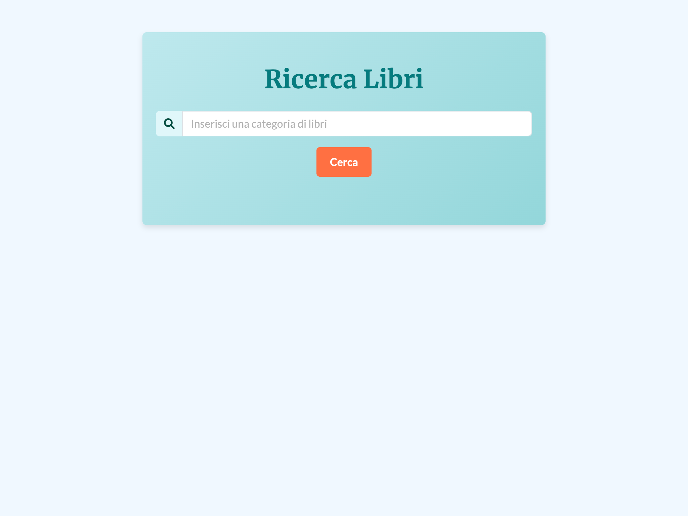

<!-- PROJECT LOGO -->
<br />
<div align="center">
  <h1 align="center">Ricerca Libri</h1>

  <p align="center">
    Una semplice applicazione per cercare libri basata su HTML, CSS, e JavaScript.
    <br />
    <a href="https://emmekkappa.github.io/RicercaLibri/"><strong>Prova l'applicazione online »</strong></a>
    <br />
    <br />
    <a href="https://github.com/emmekkappa/RicercaLibri/issues">Segnala un problema</a>
    ·
    <a href="https://github.com/emmekkappa/RicercaLibri/issues">Richiedi funzionalità</a>
  </p>
</div>

---

## **Screenshot**



---

## **Indice**

- [Descrizione](#descrizione)
- [Tecnologie Utilizzate](#tecnologie-utilizzate)
- [Installazione](#installazione)
- [Utilizzo](#utilizzo)
- [Roadmap](#roadmap)
- [Contribuire](#contribuire)
- [License](#license)
- [Contatti](#contatti)

---

## **Descrizione**

Ricerca Libri è un'applicazione web interattiva che permette agli utenti di cercare libri in base a una determinata categoria. Una volta trovati, i libri vengono visualizzati con un'anteprima della descrizione. È possibile esplorare maggiori dettagli grazie a una finestra modale.

Caratteristiche principali:
- Cerca libri per categoria.
- Visualizza un elenco di libri pertinenti con descrizione.
- Interfaccia semplice e reattiva grazie a Bootstrap 5.

---

## **Tecnologie Utilizzate**

- **HTML** - Struttura del progetto.
- **CSS** - Stile e design.
- **JavaScript** - Funzionalità dinamiche.
- **Bootstrap 5** - Per un'interfaccia utente reattiva.
- **Font Awesome** - Icone per migliorare l'usabilità.
- **Parcel** - Bundler per ottimizzare e gestire il progetto.

---

## **Installazione**

Segui questi passaggi per installare ed eseguire l'applicazione in locale:

1. Clona il repository:
   ```bash
   git clone https://github.com/emmekkappa/RicercaLibri.git


2. Accedi alla directory del progetto:

cd RicercaLibri

 3. Installa le dipendenze:

npm install

4. Avvia il server di sviluppo:

npm start

## **Utilizzo**

 1. Visita il sito in GitHub Pages.
 2. Inserisci una categoria di libri nel campo di ricerca.
 3. Clicca su “Cerca” per visualizzare i risultati.

## **Roadmap**

 • Implementare la ricerca per categoria.
 • Integrare una finestra modale per descrizioni dettagliate.
 • Aggiungere funzionalità di filtro per autore o anno.
 • Migliorare il design dell’interfaccia utente.

## **Contribuire**

Contributi sono benvenuti! Segui questi passaggi:
 1. Fai un fork del progetto.
 2. Crea il tuo branch:

git checkout -b feature/NuovaFunzionalità

 3. Fai i tuoi cambiamenti e crea un commit:

git commit -m 'Aggiungi Nuova Funzionalità'

 4. Spingi i cambiamenti:

git push origin feature/NuovaFunzionalità

 5. Apri una pull request.

## **License**

Distribuito sotto licenza MIT. Vedi LICENSE per maggiori informazioni.

## **Contatti**

Mikael Festa - mikaelstadia@gmail.com

Link al progetto: GitHub Repository